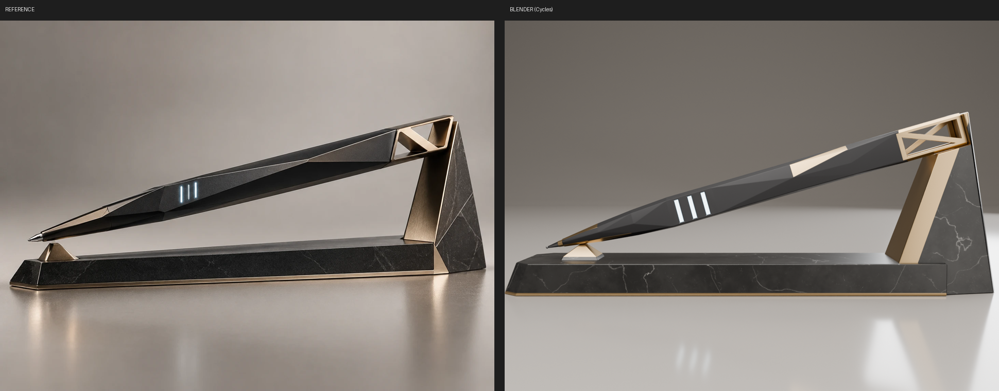

# NORECTIA オリジナル QvPen ＋ 専用スタンド（v02）

参考画像（`reference/reference_design.webp`）を最優先の基準として、Blenderでゼロからモデリングしました。
既存の3Dモデル、BOOTH素材、以前のQvPenモデルは一切流用していません。すべてのメッシュは `scripts/build_norectia_qvpen.py` が新規に生成します。



## 1. 作業環境（STEP 1）

| 項目 | 内容 |
|---|---|
| Blender | **5.2.2 LTS**（PyPIの `bpy` モジュール。GUIなしで実際のBlenderカーネルを実行） |
| Blender MCP | 利用不可 → bpyスクリプトで実際にモデルを生成し、保存・再読み込み・レンダリング・数値検証まで実施 |
| レンダラー | Cycles（CPU）。EEVEE/Workbenchはコンテナに `libEGL` がないため使用不可 |
| 単位 | Metric / 1 BU = 1 m / 表示単位 mm（350mm = 0.35） |

再生成の手順：

```bash
python scripts/build_norectia_qvpen.py --overwrite   # モデル生成・保存（--overwrite がない場合、既存ファイルは上書きしない）
python scripts/verify_blend.py                       # 再読み込みして計測 → verification_report.json
python scripts/render_views.py                       # 確認画像 → renders/
python scripts/make_comparison.py                    # 参考画像との比較画像
python scripts/export_fbx.py                         # Unity向けFBX → fbx/
# Blender本体を使う場合: blender -b -P scripts/build_norectia_qvpen.py -- --overwrite
```

## 2. 成果物

| パス | 内容 |
|---|---|
| `NORECTIA_QvPen_Custom_v02.blend` | 本体（新規ファイル。テクスチャをPack済み） |
| `textures/T_Stand_Stone_Marble_1024.png` | 黒大理石テクスチャ 1024×1024（スクリプトで生成、シームレスタイル） |
| `fbx/NORECTIA_Pen.fbx` / `fbx/NORECTIA_PenStand.fbx` | Unity用の補助FBX（モディファイア適用済み、ペンはルート変換リセット済み） |
| `renders/` | 確認画像 |
| `verification_report.json` | 再読み込み後の自動計測結果（寸法、Triangle数、干渉、UV、Transformなど） |
| `scripts/` | 生成・検証・レンダリング・書き出しスクリプト |

## 3. オブジェクト構成

```
NORECTIA_Pen            (Empty / 展示位置: loc (-0.56, 0, 81.74) mm, rot Y -16°)
├─ Pen_Body             多面体ボディ（Charcoal + Champagneのファセット + DarkMetalのスリット枠）
├─ Pen_TipMesh          ゴールドカラー + 八角ダークメタル先端 + 描画ボール
├─ Pen_RearFrame        後端N字フレーム（中空の箱型フレーム）
├─ Pen_ColorWindow_01   発光スリット（MAT_ColorWindow のみ）
├─ Pen_ColorWindow_02
├─ Pen_ColorWindow_03
├─ PenTip               Empty
├─ GripPoint            Empty
└─ PenCenter            Empty
NORECTIA_PenStand       (Empty / ワールド原点 = ベース底面中央)
├─ Stand_Base
├─ Stand_Front
└─ Stand_Rear
```

ペンとスタンドは別のEmptyの子で、コレクションも `NORECTIA_Pen` / `NORECTIA_PenStand` に分けています。表示用の複製は作っていません（スタジオ背景・ライト・カメラは `render_views.py` 内でのみ一時的に生成し、.blendには保存していません）。

## 4. 寸法（`verification_report.json` の実測値）

### ペン（ローカル座標、X = 長手方向、ペン先 = -X）

| 部分 | 実測 | 指示値 |
|---|---|---|
| 全長 | **350.0 mm**（-175 〜 +175） | 約350 |
| 最大幅 | **31.96 mm**（x=+35付近） | 30〜32 |
| 最大厚 | **26.09 mm**（後端寄り。窓位置は25.04） | 24〜26 |
| グリップ幅（GripPoint x=-98） | **25.9 × 21.2 mm** | 25〜28 |
| 描画先端の突出 | 黒ボディ端（x=-160）から **15 mm**、ゴールドカラー端から 11 mm | 10〜15 |
| 後端N字フレーム | **53 × 31 × 26 mm**（棒材 4 mm、前面プレート 4 mm） | 長さ45〜60 |
| 発光スリット | **18 × 3.0 mm**、隙間 8 mm、中心 x = -60 / -49 / -38、0.35 mm 凹み、周囲0.4 mm の暗色枠 | 約20 × 4、隙間約8 |

断面（幅×厚, mm）：x=-145: 12.8×10.5 / x=-98: 25.9×21.2 / x=-49: 30.9×25.0 / x=+35: 32.0×25.4 / x=+100: 31.1×25.7

### スタンド（ワールド座標、ベース底面 z=0）

| パーツ | 実測（L × D × H） |
|---|---|
| スタンド全体 | **389.2 × 70.0 × 142.9 mm** |
| Stand_Base | 345.1 × 70.0 × 25.0 mm（底部ゴールドライン 2.5 mm、前端の上面を10 mm後退させた傾斜＋平面の面取り） |
| Stand_Front | 30.0 × 25.0 × 11.8 mm（石材の台座2.5 mm＋ゴールドのピラミッド） |
| Stand_Rear | 80.2 × 59.9 × 142.9 mm（前面70°の傾斜、背面は約80°でほぼ垂直） |

### 展示角度・接触

- 展示角度：**16.0°**（指示の10〜16°の上限。参考画像のペンの傾きに合わせた値）
- ペン先側：ペン下面の中心線（ローカル x=-147.5〜-142.5）に `Stand_Front` の上面が **0.15 mm** の隙間で沿う
- 後端側：フレーム底面が `Stand_Rear` の受け面（ペンと同じ16°の傾斜）に **0.035 mm**、フレーム後端が止め面に0.3 mm の位置で支持される
- BVHによる交差判定：ペンとスタンドの三角形の交差 **0件**（Base / Front / Rear すべて）

## 5. Triangle数（モディファイア評価後）

| Object | Tris |
|---|---|
| Pen_Body | 726 |
| Pen_TipMesh | 292 |
| Pen_RearFrame | 364 |
| Pen_ColorWindow_01〜03 | 2 × 3 |
| **ペン合計** | **1,388** |
| Stand_Base | 92 |
| Stand_Front | 48 |
| Stand_Rear | 150 |
| **スタンド合計** | **290** |
| **総計** | **1,678** |

## 6. マテリアル・テクスチャ・UV

| Material | 用途 | 設定 |
|---|---|---|
| `MAT_Pen_Charcoal` | ボディ | Base (0.026,0.026,0.028) / Metallic 0.45 / Roughness 0.52 |
| `MAT_Metal_Champagne` | フレーム・ファセット・カラー・支持体の内側面・ベースのライン | Base (0.44,0.32,0.18) / Metallic 1 / Roughness 0.32 |
| `MAT_DarkMetal` | 先端コーン・ボール・スリットの凹み枠 | Base (0.20,0.20,0.21) / Metallic 1 / Roughness 0.22 |
| `MAT_ColorWindow` | 発光スリット（独立オブジェクト） | Emission (0.62,0.86,1.0) × 2.2（不透明。透過シェーダーなし） |
| `MAT_Stand_Stone` | 石材 | `T_Stand_Stone_Marble_1024.png` / Roughness 0.32 |

- マテリアル数：**5**（指定の5種のみ。空スロットなし）
- テクスチャ：**1枚**（1024×1024 PNG、`//textures/` への相対パス＋Pack済み）
- UV：全メッシュに `UVMap` あり
  - ペン（Body / TipMesh / RearFrame）：Smart UV Project（0〜1、重なりなし）
  - ColorWindow：0〜1の矩形
  - スタンド：ワールドスケールのボックスマッピング（300 mm = 1タイル。石目をパーツ間で連続させるため0〜1の範囲外にタイル）

## 7. Transform・Modifier・シェーディング

- 子オブジェクト（メッシュ・Empty）はすべて回転0／スケール1。メッシュの位置も0（頂点は親ローカル座標で作成）＝適用済み
- `NORECTIA_Pen` だけが展示用の変換（位置＋Y軸-16°）を持つ。**このEmptyのTransformをリセットすると、ペン先-X・原点PenCenterのニュートラルな姿勢**になる（FBXはリセットした状態で書き出し済み）
- Modifier（非破壊で保持。FBX書き出し時に適用）：
  - `Bevel`（1セグメント、角度制限）：Body 0.35 mm / 1°、RearFrame 0.3 mm / 30°、TipMesh 0.12 mm / 40°、スタンド 0.7 mm / 30°
  - `WeightedNormal`（Face Area、Keep Sharp）を全メッシュに適用し、フラットな面＋細いハイライトエッジのシェーディングにしている
  - Subdivisionは不使用。ブーリアン（スリットの凹み、フレームの開口）は生成時に適用済み
- 不可視面の削除：ボディ後端の蓋（フレーム前面プレートの内側）、カラー／コーンの裏蓋、`Stand_Front` の底面、`Stand_Rear` のベースとの接地面。この削除と、板ポリゴンである ColorWindow が、検証で出る非多様体エッジの原因です（意図的なもの）

## 8. Empty（`NORECTIA_Pen` ローカル座標）

| Empty | 座標 (mm) | 意味 |
|---|---|---|
| `PenTip` | (-175.0, 0, 0) | 描画ボールの最前端（メッシュの最小xである-175.000と一致することを検証済み） |
| `GripPoint` | (-98.0, 0, 0) | グリップ断面（25.9 × 21.2 mm）の中心 |
| `PenCenter` | (0, 0, 0) | 全長350 mmの中央 = ペンの原点 |

## 9. 造形の要点（参考画像の分析 → 実装）

- **ボディ**：断面を8か所（x = -160 / -128 / -98 / -68 / -30 / +35 / +82 / +122）で変化させ、各断面の10頂点を1対1で接続。四角形は凸になる対角線で三角形に分割し、平面に近いものは台形のまま残すので、三角形と台形のファセットが交差する建築的な面構成になる。-68〜-30は同じ断面にしてスリット用の21 mmの平面を作り、+35で側面に稜線が現れて長い斜面がフレームへ伸びる
- **ゴールドのファセット**：先端テーパーの上下面と、後方の上側面にある三角形（参考画像の位置）
- **ペン先3段**：①黒ボディのテーパー（ゴールドのファセット付き）→ ②ゴールドの八角カラー＋八角錐のダークメタル先端 → ③φ2 mmの描画ボール
- **N字フレーム**：外形は八角柱（角を2.2 mm面取り）。内部の空洞、上下の開口、後端の開口、左右の三角形の開口をブーリアンで抜き、4 mmの棒材フレーム＋斜材にした。-Y面と+Y面の斜材は向きが逆なので、どちらの側面から見てもN字になり、斜め上からは参考画像のようにX字に見える
- **スタンド**：ベースは前端が尖った長い石材のスラブ。Rearはベースの後端をまたいで床まで降り（参考画像の構成）、前面から14 mmの厚さのゴールドのスラブ＋受け面＋止め面を持つ。石材の側面には、頂点から床へ走る大きな三角形の折れ面と、背面の角の面取りがある

## 10. 参考画像から補完・調整した部分（指示値との差）

1. **スタンドの全長 389 mm（指示：ベース約450 mm）**：参考画像では、ペンの水平投影（約336 mm）とスタンドの全長の比が約0.88。450 mmにすると後方支持体がペンからかなり離れ、シルエットが変わってしまうため、画像の比率を優先した（`stand_extent()`／`TIP_OFFSET` で調整可能）
2. **スリット 18 × 3.0 mm（指示：約20 × 4 mm）**：厚さ26 mmの中で取れる平面が21.2 mmであることと、参考画像のスリットの細さに合わせた
3. 最大厚 26.09 mm：後端フレーム（26 mm）とボディ後部（25.8 mm）による（指示上限+0.09 mm）
4. 画像で見えない部分（右側面、下面、背面、フレーム内部、支持体の背面側）は、左右対称と同じ構成ルールで補完した
5. 参考画像のヘアライン仕上げのゴールドは、Blenderでは異方性反射で近似している（Unityの標準シェーダーでは再現されない）

## 11. 確認画像（`renders/`）

| # | ファイル |
|---|---|
| 1 | `01_reference_angle.png`（参考画像と同じ構図）＋ `00_comparison_reference_vs_blender.png` / `00_overlay_reference_blender.png` |
| 2 | `02_pen_left_side_-Y.png`（スリット側） |
| 3 | `03_pen_right_side_+Y.png` |
| 4 | `04_pen_top_+Z.png` |
| 5 | `05_pen_bottom_-Z.png` |
| 6 | `06_pen_front_from_tip.png` |
| 7 | `07_pen_back_from_rear.png` |
| 8 | `08_tip_closeup.png` |
| 9 | `09_rear_N_frame_closeup.png` / `09b_rear_N_frame_pen_alone.png` |
| 10 | `10_color_window_closeup.png` |
| 11 | `11_stand_only.png` |
| 12 | `12_display_three_quarter.png` / `15_display_rear_three_quarter.png` |
| 補足 | `13_front_contact.png` / `14_rear_contact.png`（接触部）、`16_pen_hero_three_quarter.png` |

## 12. 検証結果

| 判定項目 | 結果 | 根拠 |
|---|---|---|
| 1. 全体シルエットが画像に近い | PASS（目視） | `00_comparison_*`／`00_overlay_*` |
| 2. ペンのファセット面 | PASS | 断面の接続、`02`〜`07` |
| 3. ペン先が細く収束 | PASS | `08`、PenTip = メッシュ最前端 -175.000 |
| 4. 3連発光スリット | PASS | `10`、独立したオブジェクト3つ |
| 5. N字後端の空洞構造 | PASS | `09`／`09b`、ブーリアンで抜いた閉じたメッシュ（非多様体エッジ0） |
| 6. 長い石材ベース | PASS | 345 × 70 × 25 mm |
| 7. 前方の小型支持体 | PASS | `13` |
| 8. 後方の大型支持体 | PASS | `14`、`11` |
| 9. ペンとスタンドの自然な接触 | PASS | 交差0件、隙間0.15 mm／0.035 mm |
| 10. 保存・再読み込み | PASS | `verify_blend.py` で再度開いてすべての項目を計測 |
| Unity上での表示・QvPenでの動作 | **未検証** | このコンテナにUnityがないため |

## 13. QvPenに組み込む際の注意点

- QvPen本体（Prefab／Udon）は変更していない。既存のQvPenのペン先Transformに `PenTip` の位置（ペンのローカル -175 mm）を合わせ、見た目のメッシュとして `NORECTIA_Pen` 以下を差し替える想定
- FBXは `Apply Scalings: FBX All` ＋ `Apply Transform` で書き出しているので、スケールは1で入る。UnityはFBXをX軸で反転して読み込むため、**ペン先の向き（±X）はUnityで確認してから**QvPenの軸に合わせること
- 掴み判定用のColliderは含めていない。Unity側でペンにBox Collider（約350 × 32 × 26 mm、中心PenCenter）を追加する。Pickupの持ち位置には `GripPoint` を使える
- 発光色の変更：`Pen_ColorWindow_01〜03` は `MAT_ColorWindow` だけを持つ独立オブジェクト。UnityではEmission Colorを変更すれば白・赤・青・緑・黄・紫などにできる（QvPenの色変更処理との連携は未実装。Unity工程で仕様を確認してから）
- スタンドはStatic＋Mesh Colliderを想定。石材のUVはタイル状（0〜1の範囲外）なので、ライトマップを使う場合はUnityで「Generate Lightmap UVs」をONにする
- Bevel／WeightedNormalは.blendではモディファイアのまま残している。.blendを直接Unityに読ませる場合も、FBX（適用済み）を使う場合も、Normalsは「Import」にする

## 14. 未解決事項

- Unity／VRChat上での見た目、QvPenでの動作、色変更の連携は未検証（Unityがない環境のため）
- EEVEE／Workbenchでのビューポートレンダリングは未確認（Cyclesのみで確認）
- スタンドの全長を指示値450 mmではなく画像比率の389 mmにした点は、最終判断を依頼したい（パラメータ1つで変更可能）
- ゴールドのヘアライン異方性はBlender専用の表現（Unityでは均一な金属として見える）
